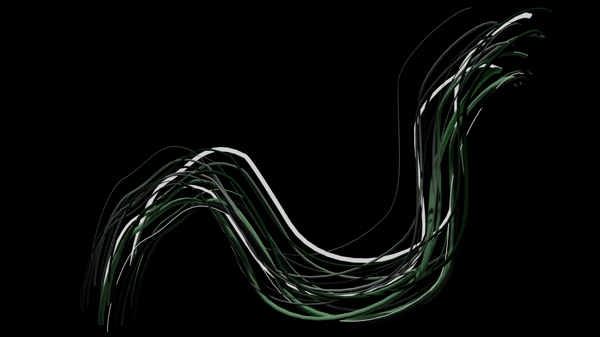
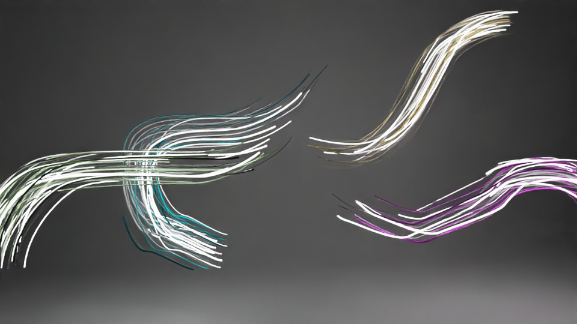
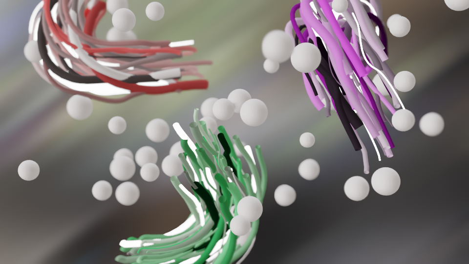

# 3D Curve Draw 

Draw in 3D for 3D procedural generation.

Blender procedural tool for animation.

Results: https://www.artstation.com/artwork/KeJLmo

## Tutorial

Draw curve:

Generate curves with animation and material:

Generate mballs with animation and material:

Render:

